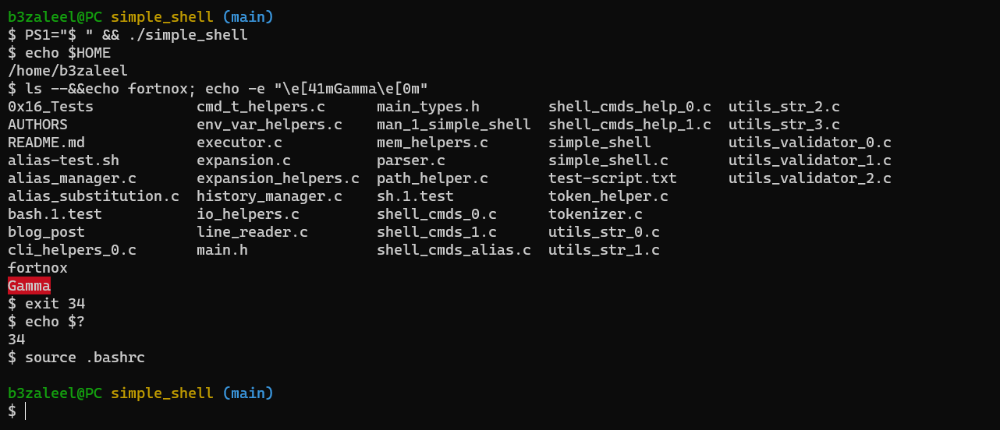

<h1 style="text-align: center">Simple Shell</h1>


## Description

This program is a simple Unix shell implemented in __C__ using the `gnu89` standard.

The purpose of this project was to demonstrate our ([Bezaleel Olakunori](https://github.com/B3zaleel) & [Elmahdi Mamoun](https://github.com/Elmahdi1962)) understanding of a variety of programming concepts and low-level system functionalities.
<br/>

Here's a screenshot of our simple shell in action.



## How To Use

Run the command below to build the shell.

```powershell
gcc -Wall -Werror -Wextra -pedantic -std=gnu89 *.c -o simple_shell
```

After compiling the program, run `./simple_shell` to startup the shell in interactive mode. To start the shell in non-interactive mode, run `./simple_shell file`, where `file` is a text-encoded file containing lines of commands to be executed. You can also pipe a string of commands to the program like `echo 'echo $PWD' | ./simple_shell` to be run in a non-interactive mode.

## Supported Control Operators

| Operator | Description |
|:--:|:--|
| ; | Separates commands into command lists that can be executed unconditionally (doesn't depend on the failure or success of the previous command) |
| && | Executes the next command in a command list if the previous command succeeded (had an exit code of 0) |
| \|\| | Executes the next command in a command list if the previous command failed (had a non-zero exit code) |

## Supported Built-In Commands

1. **Command:** *alias*<br/>**Usage:** `alias [name[='value'] ...]`<br/>**Description:** Prints a list of aliases when no arguments are provided. If a name is provided in the arguments, it prints the alias' value in the form `name='value'`. If a name-value pair is provided, it creates or assigns an alias (*name*) with the value *value*. This only happens in the *interactive* mode.
2. **Command:** *cd*<br/>**Usage:** `cd [DIRECTORY]`<br/>**Description:** Changes the shell's current working directory to *DIRECTORY* if it is provided. If *DIRECTORY* is *-*, it switches the current working directory (*PWD*) with the previous working directory (*OLDPWD*). If *DIRECTORY* is not provided, the current working directory is changed to the home directory.
3. **Command:** *env*<br/>**Usage:** `env`<br/>**Description:** Prints the list of environment variables.
4. **Command:** *exit*<br/>**Usage:** `exit status`<br/>**Description:** Exits the shell with status code *status* (ranges from 0 to 255 inclusive) or the status code of the last command that was executed.
5. **Command:** *help*<br/>**Usage:** `help`<br/>**Description:** Prints the help page of a built-in command or the program.
6. **Command:** *history*<br/>**Usage:** `history`<br/>**Description:** Prints the list of commands that have been stored by the shell.
7. **Command:** *setenv*<br/>**Usage:** `setenv VARIABLE VALUE`<br/>**Description:** Sets the value of an environment variable named *VARIABLE* to *VALUE*.
8. **Command:** *unsetenv*<br/>**Usage:** `unsetenv VARIABLE`<br/>**Description:** Removes an environment variable named *VARIABLE*.

## Getting Started (for contributors)

Install GCC on your system.
Load the bash script into your BASH terminal using `source .bashrc`. This would enable the following functions to be used:

1. `build` - Builds the program
2. `build_dbg` - Creates a debugging build of the program
3. `run` - Runs the built version of the program
4. `install` - Installs the built version of the program
5. `val` - Launches the program with **Valgrind** (should be used after **build_dbg**)
6. `viewman` - Opens the man page for the program

You can find the test suite [here](https://github.com/Elmahdi1962/0x16_Tests).
