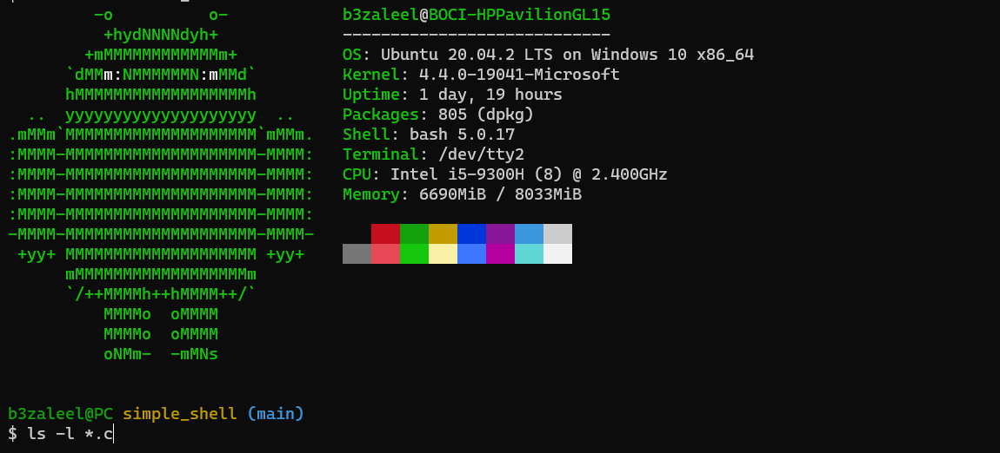
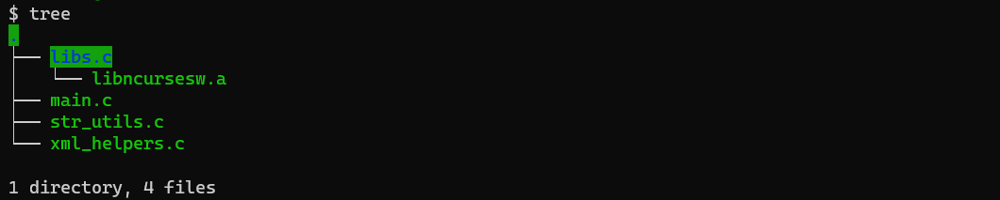

# Making a Basic Unix Shell

### … What you should know before you start making your own shell

Recently, a friend of mine and I were tasked with creating a simple shell in C. At first, I was puzzled at how we would go about doing such a thing. It wasn't until we decided to carefully analyze what a shell really does that the task became clearer to us.

I would be providing a basic explanation of the inner workings of a Unix shell with the hope that it gives you a better understanding of what you must do before you create your own basic shell.

Before we start, we need to understand what the purpose of a shell is.

A shell's purpose is to provide the user access to the services that the underlying operating system provides. This could include creating files, viewing files and folders in a directory, launching programs and so much more.
Before the shell can do any of those things, it must be launched by either the operating system or the user.

After a shell program is run, it performs its startup routines. Some of the startup routines could include reading the history or profile files (if there are any), detecting whether the terminal is interactive or not, etc. After that, the shell prints the prompt, and waits for input from the user using the `read()` system call until it receives a newline character when the user hits the enter or return key. I would be using the line of input `ls -l *.c` as a reference throughout this post.

After the user types some input and hits the return key, the shell tries to convert the input into a structure that allows it to properly execute the commands the user typed.

This process can pass through several stages depending on the complexity of the shell program. One of those stages is the *tokenization* stage.

Tokenizing a line of input would lead to the line of input being separated into parts that can be individually processed by the shell. A line of input could be separated into words and operators. 

Operators are special symbols that control the flow of multiple commands in a line of input. Operators could include "&&", "<", or ";". Words on the other hand are simply a group of characters that are bounded by an unquoted space or an operator. So in our input of reference, `ls -l *.c` we have three words: `ls`, `-l`, and `*.c`.

After separating the line of input into tokens consisting of words and operators, the shell can parse the tokens. This is where the shell warns the user for typing an operator at the beginning of a line, not closing quotes or using the wrong combination of characters that are used in operators.

The shell can move on to perform some substitutions and expansions like variable expansions, tilde expansions, filename expansions, and alias substitutions. A variable expansion would be an expansion of a variable into its value from the list of environment variables.

Assuming that I had run the input of reference in the shell and my current working directory had the following structure:

Our input of reference would be expanded to 

`ls -l libs.c main.c str_utils.c xml_helpers.c`

As a side note, if you want to know how to get the environment variables in your program, main has a third prototype, which has three parameters. The third parameter is an array of strings or character pointers consisting of the environment variables in the form **Name=Value**.

To differentiate commands from arguments, a command is either the first word in the list of tokens or the first word after an operator, the remaining words are interpreted as arguments. This would mean that the command in our input of reference is `ls`.

Execution of the commands is what the shell does after it has processed the user's line of input into its internal structure. Most shells check if the command to be executed is a built-in command or a system command. Built-in commands are executed over system commands. If it is a system command, the arguments are passed to the shell's function necessary for executing them without spawning a new process.

For system commands, a different path is taken to find them. If the command begins with a "." like in "./a.out", the shell tries to resolve the relative path to an absolute path based on the current working directory and checks if it exists. If the command doesn't appear to be a relative or absolute path, the shell has to look through each directory in the PATH environment variable to find the program. This is what the shell would have to do when you run `ls -l *.c`. The command in our input of reference could be resolved to */bin/ls* depending on which directory the shell checks first.

After resolving the command to a path the shell just needs to execute the expected file. But before that is done, the shell must check if the file exists, the file is executable, and the shell has the right to execute it. This can be checked using the **access()** system call. If all those requirements pass, the shell can move on to the next stage. If they do not pass, an error is printed to the standard error and a new line of input is requested by the shell.

To prevent the shell from terminating after executing the file using the **execve()** system call, the shell has to fork its current process and wait for the child process to terminate or finish executing. The fork and wait can be done using the **fork()** and **wait()** system calls. The shell can check if the child process failed (it wouldn't return if it succeeded) and retrieve the exit status using the WIFEXITED and WEXITSTATUS macros. A successfully executed file has an exit status of 0.

You can find the entire source code of the shell we made [here](https://medium.com/r/?url=https%3A%2F%2Fgithub.com%2FElmahdi1962%2Fsimple_shell) on GitHub. The shell performs some simple operations you would expect a shell to perform. It runs some built-in commands, performs variable expansions, executes programs and can read lines of commands from a text file.

I hope this has given you a piece of short information on what you need to know before creating your own shell.

## Shared URLS

+ [Medium](https://medium.com/@bezaleelolakunori/making-a-basic-unix-shell-70004f3167ae)
+ [LinkedIn](https://www.linkedin.com/posts/bezaleel-olakunori-34335513a_making-a-basic-unix-shell-activity-6836033361480351744-44vR)
